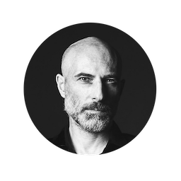

<h1 align="center">Alessandro L. Piana Bianco</h1>

  

  
  
  

<h2>Strategic Design & Product Direction</h2>

I guide organisations through transformation, leveraging system thinking, data-driven insights, and empyrical evidence.

I've been working on the digital space for over 25 years, I guess that gives me some sort of cred at least as an observer of things passing; maybe I also have something else to say. Wearing different hats at different stages of my professional life, I tried to remain coherent to myself yet changing my mind on various things. I consider <strong>change as the fundamental sign of sentient life</strong> - not in biological terms, clearly.

<h2>some things I've worked on that are worth mentioning here</h2>
<ul>
  <li>designing the first website for Tissot watches in 2000</li>
  <li>designing the private area for a private bank in 2000</li>
  <li>leading the complete redesign of motogp.com in 6 months in 2008 (the iPhone killed Flash)</li>
  <li>defining the taxonomy and meta data for information retrieval and recommendation systems in London and in Edinburgh in 2010</li>
  <li>omnichannel design as part of the nike.com redesign in 2011</li>
  <li>redesigning a bank from scracth in Greece (under <em>capital control</em>) in 2015</li>
  <li>leading the design of the first global ecommerce for Prada in 2018</li>
  <li>leading the product definition for Seven and the Qiddiya project in the Kingdom of Saudi Arabia in 2024</li>
</ul>

<h3>also</h3>

I find myself exploring too little music, delving into too few books (積ん読), capturing too few moments through my lens, intermittently fasting, and practicing yoga and meditation. Yet, there are those days when everything just aligns perfectly. Also, I <em>vehemently</em> believe in the Oxford comma.

<ul>
<li>I've lived in Bondi Beach about 1993, I did catch some good waves.</li>
<li>I've had drinks beyond the tufted leather door at the Pearl Continental in Peshawar, then we crossed the Khyber pass; it was 1996.</li>
<li>I survived Liverpool.</li>
<li>I had tea on a rooftop in Shibam, and in the outskirts of Ghadames; I had cofee in Al Makha.</li>
<li>I stared at the only existing representation of the the Pharos of Alexandria.</li>
<li>I've lived in Tarifa before it went Ibiza.</li>
<li>I've been fired at a boarding gate, once.</li>
<li>I've seen Sonic Youth live more than 40 times -- and a few other gigs in between (one of which on a Brighton beach).</li>
<li>I'm an Ashtanga and Bikram yoga practinioner (Barquillo Yoga in Madrid is where I started).</li>
<li>I speak a few languages, some of them fluently.</li>
</ul>
